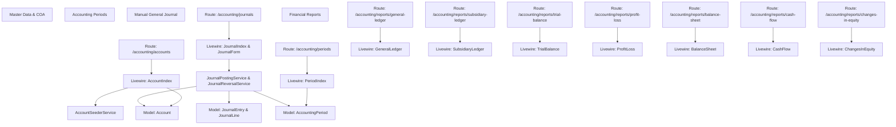

# Knowledge Graph ArtaLedger System

Dokumen ini memetakan keterhubungan antarmodul dalam sistem **ArtaLedger**.

## 📂 Peta Modul Fondasi Akuntansi & Laporan

### 1. Master COA
- **Route**: [routes/web.php](file:///d:/Belajar%20Laravel/artaledger/routes/web.php) (`/accounting/accounts`)
- **Livewire**: [app/Livewire/Accounting/Accounts/AccountIndex.php](file:///d:/Belajar%20Laravel/artaledger/app/Livewire/Accounting/Accounts/AccountIndex.php)
- **Model**: [app/Models/Account.php](file:///d:/Belajar%20Laravel/artaledger/app/Models/Account.php), [app/Models/Company.php](file:///d:/Belajar%20Laravel/artaledger/app/Models/Company.php)
- **Data**: [database/data/accounts.json](file:///d:/Belajar%20Laravel/artaledger/database/data/accounts.json)

### 2. Periode Akuntansi
- **Route**: `/accounting/periods`
- **Livewire**: [app/Livewire/Accounting/Periods/PeriodIndex.php](file:///d:/Belajar%20Laravel/artaledger/app/Livewire/Accounting/Periods/PeriodIndex.php)
- **Model**: [app/Models/AccountingPeriod.php](file:///d:/Belajar%20Laravel/artaledger/app/Models/AccountingPeriod.php)

### 3. Jurnal Umum Manual & Reversal
- **Routes**: `/accounting/journals`, `/accounting/journals/create`
- **Livewire**: [JournalIndex.php](file:///d:/Belajar%20Laravel/artaledger/app/Livewire/Accounting/Journals/JournalIndex.php), [JournalForm.php](file:///d:/Belajar%20Laravel/artaledger/app/Livewire/Accounting/Journals/JournalForm.php)
- **Services**: [JournalPostingService.php](file:///d:/Belajar%20Laravel/artaledger/app/Domain/Accounting/Services/JournalPostingService.php), [JournalReversalService.php](file:///d:/Belajar%20Laravel/artaledger/app/Domain/Accounting/Services/JournalReversalService.php)

### 4. Paket Laporan Keuangan
- **Buku Besar (Header)**: `/accounting/reports/general-ledger` ([GeneralLedger.php](file:///d:/Belajar%20Laravel/artaledger/app/Livewire/Accounting/Reports/GeneralLedger.php))
- **Buku Besar Pembantu (Detail)**: `/accounting/reports/subsidiary-ledger` ([SubsidiaryLedger.php](file:///d:/Belajar%20Laravel/artaledger/app/Livewire/Accounting/Reports/SubsidiaryLedger.php))
- **Neraca Saldo**: `/accounting/reports/trial-balance` ([TrialBalance.php](file:///d:/Belajar%20Laravel/artaledger/app/Livewire/Accounting/Reports/TrialBalance.php))
- **Laporan Laba Rugi**: `/accounting/reports/profit-loss` ([ProfitLoss.php](file:///d:/Belajar%20Laravel/artaledger/app/Livewire/Accounting/Reports/ProfitLoss.php))
- **Laporan Neraca**: `/accounting/reports/balance-sheet` ([BalanceSheet.php](file:///d:/Belajar%20Laravel/artaledger/app/Livewire/Accounting/Reports/BalanceSheet.php))
- **Laporan Arus Kas**: `/accounting/reports/cash-flow` ([CashFlow.php](file:///d:/Belajar%20Laravel/artaledger/app/Livewire/Accounting/Reports/CashFlow.php))
- **Laporan Perubahan Ekuitas**: `/accounting/reports/changes-in-equity` ([ChangesInEquity.php](file:///d:/Belajar%20Laravel/artaledger/app/Livewire/Accounting/Reports/ChangesInEquity.php))
