# Knowledge Graph ArtaLedger System

Dokumen ini memetakan keterhubungan antarmodul dalam sistem **ArtaLedger** (*Directed Acyclic Graph / DAG*).

```mermaid
graph TD
    subgraph SubGraph1["Master Data & Pengaturan"]
        A1["Route: /accounting/accounts"] --> B1["Livewire: AccountIndex"]
        A1_2["Route: /accounting/units"] --> B1_2["Livewire: UnitIndex"]
        A1_3["Route: /accounting/journal-types"] --> B1_3["Livewire: JournalTypeIndex"]
        B1 --> D1["Model: Account"]
        B1_2 --> D1_2["Model: Unit"]
        B1_3 --> D1_3["Model: JournalType"]
    end

    subgraph SubGraph2["Periode Akuntansi"]
        A2["Route: /accounting/periods"] --> B2["Livewire: PeriodIndex"]
        B2 --> D2["Model: AccountingPeriod"]
    end

    subgraph SubGraph3["Modul Impor Jurnal Excel"]
        A3_IMP["Route: /accounting/import"] --> B3_IMP["Livewire: JournalImportWizard"]
        B3_IMP --> C3_IMP1["Service: ExcelImportService"]
        B3_IMP --> C3_IMP2["Service: ImportValidationService"]
        B3_IMP --> C3_IMP3["Service: ImportCommitService"]
        C3_IMP1 --> D3_IMP1["Models: ImportBatch, ImportFile, ImportRow"]
        C3_IMP3 --> D3["Models: JournalEntry, JournalLine"]
    end

    subgraph SubGraph4["Posting & Laporan Saldo Awal"]
        A4_SA["Seeder: SaldoAwalSeeder"] --> D4_SA["database/data/saldo_awal.json"]
        D4_SA --> D3
        A4_REP["Route: /accounting/reports/opening-balance"] --> B4_REP["Livewire: OpeningBalanceIndex"]
        B4_REP --> D3
        B4_REP --> D1
    end

    subgraph SubGraph5["Paket Laporan Keuangan Official"]
        A5_1["Route: /accounting/reports/general-ledger"] --> B5_1["Livewire: GeneralLedger"]
        A5_2["Route: /accounting/reports/subsidiary-ledger"] --> B5_2["Livewire: SubsidiaryLedger"]
        A5_3["Route: /accounting/reports/worksheet"] --> B5_3["Livewire: Worksheet"]
        A5_4["Route: /accounting/reports/trial-balance"] --> B5_4["Livewire: TrialBalance"]
        A5_5["Route: /accounting/reports/balance-sheet"] --> B5_5["Livewire: BalanceSheet"]
        A5_6["Route: /accounting/reports/profit-loss"] --> B5_6["Livewire: ProfitLoss"]
        A5_7["Route: /accounting/reports/cash-flow"] --> B5_7["Livewire: CashFlow"]
        A5_8["Route: /accounting/reports/changes-in-equity"] --> B5_8["Livewire: ChangesInEquity"]
        
        B5_1 --> D3
        B5_3 --> D3
        B5_6 --> D3
    end
```

---

## 📂 Peta Modul & Keterhubungan File

### 1. Master Data & Pengaturan
- **Master COA**: [routes/web.php](file:///d:/Belajar%20Laravel/artaledger/routes/web.php) (`/accounting/accounts`) $\rightarrow$ [AccountIndex.php](file:///d:/Belajar%20Laravel/artaledger/app/Livewire/Accounting/Accounts/AccountIndex.php) $\rightarrow$ [Account.php](file:///d:/Belajar%20Laravel/artaledger/app/Models/Account.php)
- **Unit Perusahaan**: `/accounting/units` $\rightarrow$ [UnitIndex.php](file:///d:/Belajar%20Laravel/artaledger/app/Livewire/Accounting/Settings/UnitIndex.php) $\rightarrow$ [Unit.php](file:///d:/Belajar%20Laravel/artaledger/app/Models/Unit.php)
- **Jenis Jurnal**: `/accounting/journal-types` $\rightarrow$ [JournalTypeIndex.php](file:///d:/Belajar%20Laravel/artaledger/app/Livewire/Accounting/Settings/JournalTypeIndex.php) $\rightarrow$ [JournalType.php](file:///d:/Belajar%20Laravel/artaledger/app/Models/JournalType.php)

### 2. Impor Jurnal Excel (`/accounting/import`)
- **Controller Web**: [JournalImportWizard.php](file:///d:/Belajar%20Laravel/artaledger/app/Livewire/Accounting/Import/JournalImportWizard.php)
- **View Blade**: [journal-import-wizard.blade.php](file:///d:/Belajar%20Laravel/artaledger/resources/views/livewire/accounting/import/journal-import-wizard.blade.php)
- **Domain Services**:
  - [ExcelImportService.php](file:///d:/Belajar%20Laravel/artaledger/app/Domain/Import/Services/ExcelImportService.php) (Parsing Sheet & VLOOKUP Engine)
  - [ImportValidationService.php](file:///d:/Belajar%20Laravel/artaledger/app/Domain/Import/Services/ImportValidationService.php) (Validasi Kode Akun & Balance)
  - [ImportCommitService.php](file:///d:/Belajar%20Laravel/artaledger/app/Domain/Import/Services/ImportCommitService.php) (Posting ke GL)
  - [UnitMappingService.php](file:///d:/Belajar%20Laravel/artaledger/app/Domain/Import/Services/UnitMappingService.php) (Deteksi Kata Kunci Unit)
- **Models Staging**: `ImportBatch`, `ImportFile`, `ImportRow`

### 3. Modul Saldo Awal Akuntansi (`/accounting/reports/opening-balance`)
- **Seeder Master**: [SaldoAwalSeeder.php](file:///d:/Belajar%20Laravel/artaledger/database/seeders/SaldoAwalSeeder.php) $\leftarrow$ [saldo_awal.json](file:///d:/Belajar%20Laravel/artaledger/database/data/saldo_awal.json)
- **Controller Laporan**: [OpeningBalanceIndex.php](file:///d:/Belajar%20Laravel/artaledger/app/Livewire/Accounting/OpeningBalance/OpeningBalanceIndex.php)
- **View Blade**: [opening-balance-index.blade.php](file:///d:/Belajar%20Laravel/artaledger/resources/views/livewire/accounting/opening-balance/opening-balance-index.blade.php)

### 4. Paket 6 Laporan Keuangan Official
1. **Buku Besar**: `/accounting/reports/general-ledger` ([GeneralLedger.php](file:///d:/Belajar%20Laravel/artaledger/app/Livewire/Accounting/Reports/GeneralLedger.php)) & `/accounting/reports/subsidiary-ledger` ([SubsidiaryLedger.php](file:///d:/Belajar%20Laravel/artaledger/app/Livewire/Accounting/Reports/SubsidiaryLedger.php)) $\rightarrow$ `<x-ledger-nav />`
2. **Neraca**: `/accounting/reports/worksheet` ([Worksheet.php](file:///d:/Belajar%20Laravel/artaledger/app/Livewire/Accounting/Reports/Worksheet.php)), `/accounting/reports/trial-balance` ([TrialBalance.php](file:///d:/Belajar%20Laravel/artaledger/app/Livewire/Accounting/Reports/TrialBalance.php)), & `/accounting/reports/balance-sheet` ([BalanceSheet.php](file:///d:/Belajar%20Laravel/artaledger/app/Livewire/Accounting/Reports/BalanceSheet.php)) $\rightarrow$ `<x-report-nav />`
3. **Laba Rugi**: `/accounting/reports/profit-loss` ([ProfitLoss.php](file:///d:/Belajar%20Laravel/artaledger/app/Livewire/Accounting/Reports/ProfitLoss.php))
4. **Arus Kas**: `/accounting/reports/cash-flow` ([CashFlow.php](file:///d:/Belajar%20Laravel/artaledger/app/Livewire/Accounting/Reports/CashFlow.php))
5. **Saldo Awal**: `/accounting/reports/opening-balance` ([OpeningBalanceIndex.php](file:///d:/Belajar%20Laravel/artaledger/app/Livewire/Accounting/OpeningBalance/OpeningBalanceIndex.php))
6. **Perubahan Ekuitas**: `/accounting/reports/changes-in-equity` ([ChangesInEquity.php](file:///d:/Belajar%20Laravel/artaledger/app/Livewire/Accounting/Reports/ChangesInEquity.php))

### 5. Suite Pengujian Otomatis Pest PHP
- [tests/Feature/Accounting/OpeningBalanceTest.php](file:///d:/Belajar%20Laravel/artaledger/tests/Feature/Accounting/OpeningBalanceTest.php)
- [tests/Feature/Accounting/ImportJournalTest.php](file:///d:/Belajar%20Laravel/artaledger/tests/Feature/Accounting/ImportJournalTest.php)
- [tests/Feature/Accounting/AccountManagementTest.php](file:///d:/Belajar%20Laravel/artaledger/tests/Feature/Accounting/AccountManagementTest.php)
- [tests/Feature/Accounting/CoreAccountingTest.php](file:///d:/Belajar%20Laravel/artaledger/tests/Feature/Accounting/CoreAccountingTest.php)
- [tests/Feature/Accounting/FinancialReportsTest.php](file:///d:/Belajar%20Laravel/artaledger/tests/Feature/Accounting/FinancialReportsTest.php)
