# Knowledge Graph ArtaLedger System

Dokumen ini memetakan keterhubungan antarmodul dalam sistem **ArtaLedger** (*Directed Acyclic Graph / DAG*), mencakup seluruh rute HTTP, komponen Livewire, controller, domain service layer, model Eloquent, dan pengujian Pest PHP.

```mermaid
graph TD
    subgraph SG_Core["1. Master Data & Pengaturan"]
        A_COA["Route: /accounting/accounts"] --> B_COA["Livewire: AccountIndex"]
        A_GRP["Route: /accounting/account-groups"] --> B_GRP["Livewire: AccountGroupIndex"]
        A_UNT["Route: /accounting/units"] --> B_UNT["Livewire: UnitIndex"]
        A_JTY["Route: /accounting/journal-types"] --> B_JTY["Livewire: JournalTypeIndex"]
        A_CMP["Route: /accounting/settings/company"] --> B_CMP["Livewire: CompanySettingsIndex"]
        
        B_COA --> M_ACC["Model: Account"]
        B_GRP --> M_AGRP["Model: AccountGroup"]
        B_UNT --> M_UNT["Model: Unit"]
        B_JTY --> M_JTY["Model: JournalType"]
        B_CMP --> M_CMP["Model: Company (Branding & Signers)"]
    end

    subgraph SG_Journal["2. Jurnal & Penyesuaian"]
        A_JRN["Route: /accounting/journals"] --> B_JRN["Livewire: JournalIndex, JournalForm"]
        A_ADJ["Route: /accounting/adjustments"] --> B_ADJ["Livewire: AdjustmentIndex, AdjustmentForm"]
        A_TPL["Route: /accounting/journals/templates"] --> B_TPL["Livewire: JournalTemplateIndex"]
        
        B_JRN --> M_JE["Model: JournalEntry"]
        B_JRN --> M_JL["Model: JournalLine"]
        B_ADJ --> M_JE
        B_TPL --> M_JTPL["Model: JournalTemplate"]
    end

    subgraph SG_Import["3. Modul Impor Excel"]
        A_IMP["Route: /accounting/import"] --> B_IMP["Livewire: JournalImportWizard"]
        B_IMP --> S_IMP1["Service: ExcelImportService"]
        B_IMP --> S_IMP2["Service: ImportValidationService"]
        B_IMP --> S_IMP3["Service: ImportCommitService"]
        S_IMP1 --> M_IMP["Models: ImportBatch, ImportFile, ImportRow"]
        S_IMP3 --> M_JE
        S_IMP3 --> M_JL
    end

    subgraph SG_Recon["4. Rekonsiliasi Bank BRI CMS"]
        A_REC["Route: /accounting/reconciliation"] --> B_REC["Livewire: BankReconciliationIndex"]
        A_RECD["Route: /accounting/reconciliation/{statement}"] --> B_RECD["Livewire: BankReconciliationDetail"]
        A_RECP["Route: /accounting/reconciliation/{statement}/pdf"] --> C_RECP["Controller: BankReconciliationPdfController"]
        
        B_REC --> S_BRI["Service: BriCmsPdfParserService"]
        B_RECD --> S_REC["Service: BankReconciliationService"]
        S_REC --> M_BST["Model: BankStatement"]
        S_REC --> M_BSL["Model: BankStatementLine"]
        S_REC --> M_BMG["Model: BankReconciliationMatchGroup"]
        S_REC --> M_JL
    end

    subgraph SG_Assets["5. Manajemen Aset Tetap & Depresiasi"]
        A_AST["Route: /accounting/fixed-assets"] --> B_AST["Livewire: FixedAssetIndex"]
        A_DEP["Route: /accounting/fixed-assets/depreciation"] --> B_DEP["Livewire: DepreciationRun"]
        A_SCN["Public Route: /a/{code}"] --> C_SCN["Controller: AssetScanController"]
        
        B_DEP --> S_DEP["Service: FixedAssetDepreciationService"]
        S_DEP --> M_AST["Model: FixedAsset"]
        S_DEP --> M_ACAT["Model: AssetCategory"]
        S_DEP --> M_ADEP["Model: AssetDepreciation"]
        S_DEP --> M_JE
    end

    subgraph SG_Reports["6. Paket Laporan Keuangan & Ekspor"]
        A_REP_GL["Route: .../reports/general-ledger"] --> B_REP_GL["Livewire: GeneralLedger"]
        A_REP_SL["Route: .../reports/subsidiary-ledger"] --> B_REP_SL["Livewire: SubsidiaryLedger"]
        A_REP_OB["Route: .../reports/opening-balance"] --> B_REP_OB["Livewire: OpeningBalanceIndex"]
        A_REP_WS["Route: .../reports/worksheet"] --> B_REP_WS["Livewire: Worksheet"]
        A_REP_TB["Route: .../reports/trial-balance"] --> B_REP_TB["Livewire: TrialBalance"]
        A_REP_PL["Route: .../reports/profit-loss"] --> B_REP_PL["Livewire: ProfitLoss"]
        A_REP_BS["Route: .../reports/balance-sheet"] --> B_REP_BS["Livewire: BalanceSheet"]
        A_REP_CF["Route: .../reports/cash-flow"] --> B_REP_CF["Livewire: CashFlow"]
        A_REP_EQ["Route: .../reports/changes-in-equity"] --> B_REP_EQ["Livewire: ChangesInEquity"]
        
        A_EXP_PDF["Route: .../reports/export/pdf/{type}"] --> C_PDF["Controller: FinancialReportPdfController"]
        A_EXP_XLS["Route: .../reports/export/excel/{type}"] --> C_XLS["Controller: FinancialReportExcelController"]
        
        C_PDF --> S_RPDF["Service: FinancialReportPdfService"]
        C_XLS --> S_RXLS["Service: FinancialReportExcelService"]
        
        B_REP_TB --> M_ACC
        B_REP_TB --> M_JL
        S_RPDF --> M_CMP
        S_RXLS --> M_CMP
    end
```

---

## 📂 Peta Modul & Keterhubungan File

### 1. Master Data & Pengaturan Perusahaan
- **Chart of Accounts (COA)**: [routes/web.php](file:///d:/Belajar%20Laravel/artaledger/routes/web.php) (`/accounting/accounts`) $\rightarrow$ [AccountIndex.php](file:///d:/Belajar%20Laravel/artaledger/app/Livewire/Accounting/Accounts/AccountIndex.php) $\rightarrow$ [Account.php](file:///d:/Belajar%20Laravel/artaledger/app/Models/Account.php)
- **Account Groups**: `/accounting/account-groups` $\rightarrow$ [AccountGroupIndex.php](file:///d:/Belajar%20Laravel/artaledger/app/Livewire/Accounting/Accounts/AccountGroupIndex.php) $\rightarrow$ [AccountGroup.php](file:///d:/Belajar%20Laravel/artaledger/app/Models/AccountGroup.php)
- **Unit Perusahaan**: `/accounting/units` $\rightarrow$ [UnitIndex.php](file:///d:/Belajar%20Laravel/artaledger/app/Livewire/Accounting/Settings/UnitIndex.php) $\rightarrow$ [Unit.php](file:///d:/Belajar%20Laravel/artaledger/app/Models/Unit.php)
- **Jenis Jurnal**: `/accounting/journal-types` $\rightarrow$ [JournalTypeIndex.php](file:///d:/Belajar%20Laravel/artaledger/app/Livewire/Accounting/Settings/JournalTypeIndex.php) $\rightarrow$ [JournalType.php](file:///d:/Belajar%20Laravel/artaledger/app/Models/JournalType.php)
- **Branding & Penandatangan Dokumen**: `/accounting/settings/company` $\rightarrow$ [CompanySettingsIndex.php](file:///d:/Belajar%20Laravel/artaledger/app/Livewire/Accounting/Settings/CompanySettingsIndex.php) $\rightarrow$ [Company.php](file:///d:/Belajar%20Laravel/artaledger/app/Models/Company.php)
  - Mengatur Logo Perusahaan, Favicon dinamis, Nama Perusahaan, dan Pejabat Penandatangan Laporan Keuangan (*Disusun*, *Diperiksa*, *Disetujui*).

### 2. Jurnal Umum, Penyesuaian & Template
- **Jurnal Umum**: `/accounting/journals` $\rightarrow$ [JournalIndex.php](file:///d:/Belajar%20Laravel/artaledger/app/Livewire/Accounting/Journals/JournalIndex.php), [JournalForm.php](file:///d:/Belajar%20Laravel/artaledger/app/Livewire/Accounting/Journals/JournalForm.php)
- **Jurnal Penyesuaian**: `/accounting/adjustments` $\rightarrow$ [AdjustmentIndex.php](file:///d:/Belajar%20Laravel/artaledger/app/Livewire/Accounting/Journals/AdjustmentIndex.php), [AdjustmentForm.php](file:///d:/Belajar%20Laravel/artaledger/app/Livewire/Accounting/Journals/AdjustmentForm.php)
- **Template Jurnal**: `/accounting/journals/templates` $\rightarrow$ [JournalTemplateIndex.php](file:///d:/Belajar%20Laravel/artaledger/app/Livewire/Accounting/Journals/JournalTemplateIndex.php)
- **Model Inti**: [JournalEntry.php](file:///d:/Belajar%20Laravel/artaledger/app/Models/JournalEntry.php), [JournalLine.php](file:///d:/Belajar%20Laravel/artaledger/app/Models/JournalLine.php)

### 3. Modul Impor Jurnal Excel (`/accounting/import`)
- **Controller Web**: [JournalImportWizard.php](file:///d:/Belajar%20Laravel/artaledger/app/Livewire/Accounting/Import/JournalImportWizard.php)
- **Domain Services**:
  - [ExcelImportService.php](file:///d:/Belajar%20Laravel/artaledger/app/Domain/Import/Services/ExcelImportService.php) (Parsing Sheet & VLOOKUP Engine)
  - [ImportValidationService.php](file:///d:/Belajar%20Laravel/artaledger/app/Domain/Import/Services/ImportValidationService.php) (Validasi Kode Akun & Balance)
  - [ImportCommitService.php](file:///d:/Belajar%20Laravel/artaledger/app/Domain/Import/Services/ImportCommitService.php) (Posting ke Buku Besar)
  - [UnitMappingService.php](file:///d:/Belajar%20Laravel/artaledger/app/Domain/Import/Services/UnitMappingService.php) (Deteksi Kata Kunci Unit Otomatis)

### 4. Rekonsiliasi Bank BRI CMS (`/accounting/reconciliation`)
- **Daftar Rekening Koran**: `/accounting/reconciliation` $\rightarrow$ [BankReconciliationIndex.php](file:///d:/Belajar%20Laravel/artaledger/app/Livewire/Accounting/Reconciliation/BankReconciliationIndex.php)
- **Workspace Pencocokan**: `/accounting/reconciliation/{statement}` $\rightarrow$ [BankReconciliationDetail.php](file:///d:/Belajar%20Laravel/artaledger/app/Livewire/Accounting/Reconciliation/BankReconciliationDetail.php)
- **Domain Services**:
  - [BriCmsPdfParserService.php](file:///d:/Belajar%20Laravel/artaledger/app/Domain/Banking/Services/BriCmsPdfParserService.php) (Ekstraksi mutasi rekening koran format BRI Cash Management System)
  - [BankReconciliationService.php](file:///d:/Belajar%20Laravel/artaledger/app/Domain/Banking/Services/BankReconciliationService.php) (Pencocokan N:M fleksibel, toleransi pembulatan Rp 2, penanganan cek beredar/outstanding check, dan pelacakan transaksi lintas periode)
- **Ekspor PDF Berita Acara**: [BankReconciliationPdfController.php](file:///d:/Belajar%20Laravel/artaledger/app/Http/Controllers/BankReconciliationPdfController.php) $\rightarrow$ [reconciliation-report.blade.php](file:///d:/Belajar%20Laravel/artaledger/resources/views/pdf/reports/reconciliation-report.blade.php)

### 5. Manajemen Aset Tetap & Depresiasi Otomatis (`/accounting/fixed-assets`)
- **Register Aset Tetap**: `/accounting/fixed-assets` $\rightarrow$ [FixedAssetIndex.php](file:///d:/Belajar%20Laravel/artaledger/app/Livewire/Accounting/Assets/FixedAssetIndex.php)
  - CRUD Kategori Aset & Pemetaan Akun GL ([AssetCategory.php](file:///d:/Belajar%20Laravel/artaledger/app/Models/AssetCategory.php))
  - Upload Foto Aset & Manajemen Nilai Sisa/Umur Ekonomis ([FixedAsset.php](file:///d:/Belajar%20Laravel/artaledger/app/Models/FixedAsset.php))
  - Cetak Label QR Code & Barcode Industri (Mode Roll Thermal 80x50mm & Mode Grid Lembar A4)
- **Eksekusi Depresiasi Periodik**: `/accounting/fixed-assets/depreciation` $\rightarrow$ [DepreciationRun.php](file:///d:/Belajar%20Laravel/artaledger/app/Livewire/Accounting/Assets/DepreciationRun.php)
  - [FixedAssetDepreciationService.php](file:///d:/Belajar%20Laravel/artaledger/app/Domain/Asset/Services/FixedAssetDepreciationService.php) (Perhitungan metode Garis Lurus / Straight-Line dan penjurnalan otomatis ke Buku Besar)
- **Halaman Pemindaian Publik**: `/a/{code}` $\rightarrow$ [AssetScanController.php](file:///d:/Belajar%20Laravel/artaledger/app/Http/Controllers/AssetScanController.php) $\rightarrow$ [scan.blade.php](file:///d:/Belajar%20Laravel/artaledger/resources/views/assets/scan.blade.php)

### 6. Paket Laporan Keuangan & Ekspor Multi-Format
Modul pelaporan keuangan dilengkapi tombol dropdown ekspor terpadu ([report-export-dropdown.blade.php](file:///d:/Belajar%20Laravel/artaledger/resources/views/components/report-export-dropdown.blade.php)):
1. **Buku Besar (General Ledger)**: `/accounting/reports/general-ledger` ([GeneralLedger.php](file:///d:/Belajar%20Laravel/artaledger/app/Livewire/Accounting/Reports/GeneralLedger.php))
2. **Buku Besar Pembantu (Subsidiary Ledger)**: `/accounting/reports/subsidiary-ledger` ([SubsidiaryLedger.php](file:///d:/Belajar%20Laravel/artaledger/app/Livewire/Accounting/Reports/SubsidiaryLedger.php))
3. **Neraca Lajur (Worksheet)**: `/accounting/reports/worksheet` ([Worksheet.php](file:///d:/Belajar%20Laravel/artaledger/app/Livewire/Accounting/Reports/Worksheet.php))
4. **Neraca Saldo (Trial Balance)**: `/accounting/reports/trial-balance` ([TrialBalance.php](file:///d:/Belajar%20Laravel/artaledger/app/Livewire/Accounting/Reports/TrialBalance.php))
5. **Laba Rugi (Profit & Loss)**: `/accounting/reports/profit-loss` ([ProfitLoss.php](file:///d:/Belajar%20Laravel/artaledger/app/Livewire/Accounting/Reports/ProfitLoss.php))
6. **Neraca (Balance Sheet)**: `/accounting/reports/balance-sheet` ([BalanceSheet.php](file:///d:/Belajar%20Laravel/artaledger/app/Livewire/Accounting/Reports/BalanceSheet.php))
7. **Arus Kas (Cash Flow)**: `/accounting/reports/cash-flow` ([CashFlow.php](file:///d:/Belajar%20Laravel/artaledger/app/Livewire/Accounting/Reports/CashFlow.php))
8. **Perubahan Ekuitas (Changes in Equity)**: `/accounting/reports/changes-in-equity` ([ChangesInEquity.php](file:///d:/Belajar%20Laravel/artaledger/app/Livewire/Accounting/Reports/ChangesInEquity.php))
9. **Saldo Awal**: `/accounting/reports/opening-balance` ([OpeningBalanceIndex.php](file:///d:/Belajar%20Laravel/artaledger/app/Livewire/Accounting/OpeningBalance/OpeningBalanceIndex.php))
- **Ekspor Dokumen PDF**: [FinancialReportPdfController.php](file:///d:/Belajar%20Laravel/artaledger/app/Http/Controllers/FinancialReportPdfController.php) $\rightarrow$ [FinancialReportPdfService.php](file:///d:/Belajar%20Laravel/artaledger/app/Domain/Accounting/Services/FinancialReportPdfService.php) (Layout A4 cetak siap tanda tangan dan toleransi sub-rupiah `< 1.0`)
- **Ekspor Dokumen Excel**: [FinancialReportExcelController.php](file:///d:/Belajar%20Laravel/artaledger/app/Http/Controllers/FinancialReportExcelController.php) $\rightarrow$ [FinancialReportExcelService.php](file:///d:/Belajar%20Laravel/artaledger/app/Domain/Accounting/Services/FinancialReportExcelService.php) (Format `.xlsx` dengan formula dan format mata uang akuntansi)

### 7. Suite Pengujian Otomatis Pest PHP
- [tests/Feature/Accounting/TrialBalanceBalanceVerificationTest.php](file:///d:/Belajar%20Laravel/artaledger/tests/Feature/Accounting/TrialBalanceBalanceVerificationTest.php) (Verifikasi Neraca Saldo Seimbang)
- [tests/Feature/Accounting/FinancialReportPdfTest.php](file:///d:/Belajar%20Laravel/artaledger/tests/Feature/Accounting/FinancialReportPdfTest.php) (Validasi Cetak PDF Laporan Keuangan)
- [tests/Feature/Accounting/FinancialReportExcelTest.php](file:///d:/Belajar%20Laravel/artaledger/tests/Feature/Accounting/FinancialReportExcelTest.php) (Validasi Ekspor Excel Laporan Keuangan)
- [tests/Feature/Banking/BankReconciliationTest.php](file:///d:/Belajar%20Laravel/artaledger/tests/Feature/Banking/BankReconciliationTest.php) (Pencocokan Rekonsiliasi Bank)
- [tests/Feature/Banking/BankReconciliationMultiMatchTest.php](file:///d:/Belajar%20Laravel/artaledger/tests/Feature/Banking/BankReconciliationMultiMatchTest.php) (Pencocokan Multi N:M & Toleransi)
- [tests/Feature/Banking/BankReconciliationCrossPeriodTest.php](file:///d:/Belajar%20Laravel/artaledger/tests/Feature/Banking/BankReconciliationCrossPeriodTest.php) (Pencatatan Lintas Periode)
- [tests/Feature/Asset/FixedAssetTest.php](file:///d:/Belajar%20Laravel/artaledger/tests/Feature/Asset/FixedAssetTest.php) (Depresiasi & Label Aset Tetap)
- [tests/Feature/Accounting/CompanySettingsTest.php](file:///d:/Belajar%20Laravel/artaledger/tests/Feature/Accounting/CompanySettingsTest.php) (Pengaturan Branding & Signers)
- [tests/Feature/Accounting/OpeningBalanceTest.php](file:///d:/Belajar%20Laravel/artaledger/tests/Feature/Accounting/OpeningBalanceTest.php)
- [tests/Feature/Accounting/ImportJournalTest.php](file:///d:/Belajar%20Laravel/artaledger/tests/Feature/Accounting/ImportJournalTest.php)
