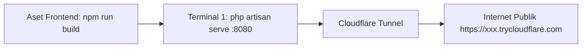

# 🚀 Panduan Menjalankan Public Demo Tunnel (ArtaLedger)

Panduan ini berisi perintah-perintah terminal yang perlu dijalankan di komputer lokal agar aplikasi **ArtaLedger** dapat diakses secara publik melalui internet (menggunakan Cloudflare Tunnel).

---

## 📋 Ringkasan Alur Kerja



---

## 🛠️ Langkah-Langkah di Terminal

### Langkah 1: Build Aset Frontend (Opsional / Sekali Saja)
Jalankan perintah ini jika Anda baru saja mengubah kode tampilan/CSS atau ingin memastikan aset termuat secara optimal untuk pengguna luar:

```powershell
npm run build
```

---

### Langkah 2: Jalankan Laravel Server (Terminal 1)
Buka tab/jendela terminal pertama di direktori proyek, lalu jalankan:

```powershell
php artisan serve --host=127.0.0.1 --port=8080
```

> **Catatan:** Biarkan terminal ini tetap terbuka dan berjalan (*running*).

---

### Langkah 3: Jalankan Cloudflare Tunnel (Terminal 2)
Buka tab/jendela terminal kedua, lalu jalankan:

```powershell
& "C:\Program Files (x86)\cloudflared\cloudflared.exe" tunnel --url http://127.0.0.1:8080
```

*(Jika `cloudflared` sudah terdaftar di Environment Variable / PATH sistem, Anda cukup mengetikkan `cloudflared tunnel --url http://127.0.0.1:8080`).*

---

## 🔗 Mengambil URL Publik

Perhatikan output di **Terminal 2**. Dalam beberapa detik akan muncul kotak informasi seperti berikut:

```text
+--------------------------------------------------------------------------------------------+
|  Your quick Tunnel has been created! Visit it at (it may take some time to be reachable):  |
|  https://nama-subdomain-acak.trycloudflare.com                                             |
+--------------------------------------------------------------------------------------------+
```

Salin URL tersebut dan tambahkan `/login` untuk dibagikan, misalnya:
`https://nama-subdomain-acak.trycloudflare.com/login`

---

## 🔑 Kredensial Akun Demo Bawaan

| Role | Email | Password |
| :--- | :--- | :--- |
| **Admin** | `admin@artaledger.com` | `password` |
| **Reviewer** | `review@artaledger.com` | `password` |
| **Staff** | `staff@artaledger.com` | `password` |

---

## 🛑 Cara Menghentikan Layanan
Untuk mematikan akses publik dan server lokal:
1. Tekan **`Ctrl + C`** pada **Terminal 2** (Cloudflare).
2. Tekan **`Ctrl + C`** pada **Terminal 1** (Laravel Server).
